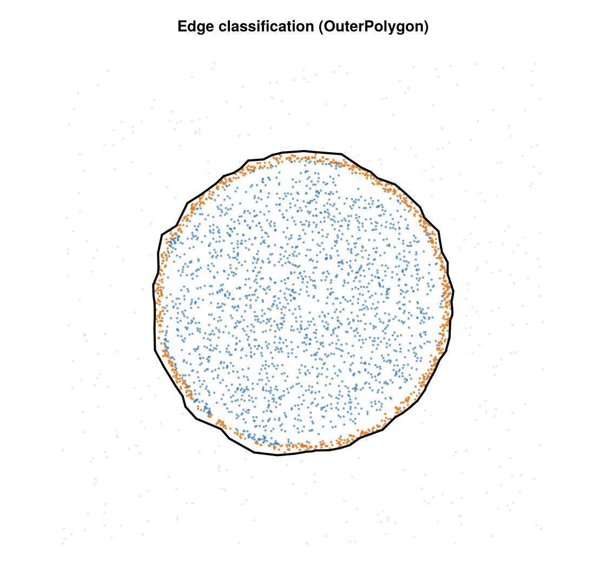

# Edge / Membrane Classification

Classify each 2D SMLM emitter as `:outside`, `:membrane`, or `:interior` — the
off-cell background, the cell-boundary band, and the cell interior. The verb
`classify_emitters` is a peer of the package's `cluster` / `cluster_statistics`:
the **concrete config type selects the tissue-gate strategy by dispatch**, and the
result is an `EdgeClassifyInfo`. A field of view may hold **more than one cell** — the
published boundary is a [multi-cell mask](#Multi-cell-mask).



*A synthetic cell classified into interior (blue), membrane (orange), and outside
background (gray).*

## API

```julia
smld_out, info = classify_emitters(smld::BasicSMLD, cfg::AbstractEdgeClassifyConfig)
info           = classify_emitters(x_um, y_um, cfg::AbstractEdgeClassifyConfig; fov_um)
```

- **SMLD form** (pipeline-facing, `(out, Info)` convention): returns the smld with the
  published mask threaded into `smld.metadata["edge_cells"]` (a `MultiCellMask`) and the
  dominant cell's outer ring into `smld.metadata["edge_outer_polygon"]` (back-compat /
  Hopkins `region = :metadata`), plus the `EdgeClassifyInfo`. `fov_um` is taken from
  `smld.camera.pixel_edges_x/y`. The per-emitter **class is not mirrored into metadata** —
  it lives in `info.class`, read via `in_cell(info)` / `interior_mask(info)`. (A
  per-emitter side-list in metadata would silently desync the moment a downstream step
  subsets emitters; only the *geometry* — safe under subsetting — is mirrored.)
- **Coordinate form** (computational core): returns the `info` directly.
  `fov_um = (xmin, xmax, ymin, ymax)` in µm (accepts any `Real` tuple).

## Concept

The pipeline is shared across configs; only the first step (the **tissue gate**) is
config-specific:

1. **Tissue gate** — decide which localizations are cell tissue (per-config, below).
2. **Relative-density gate** — drop isolated outlier whiskers whose local count is below
   `core_frac ×` the tissue median (relative, so it self-scales with density; `0`
   disables it).
3. **Multi-scale adaptive alpha-shape** — build boundary loops with a per-triangle α (below).
4. **Multi-cell mask** — group the loops into cells with `build_mask`.
5. **Per-emitter labeling** — `:interior` inside a cell, `:membrane` within `membrane_nm`
   of a *real* cell edge (FOV-cut boundary segments are excluded, so a field-of-view cut
   is never mislabeled membrane), `:outside` otherwise.

### Multi-scale adaptive α

With `alpha_adaptive = true` (default), each Delaunay triangle `T` is kept iff its
circumradius is at most

```math
\alpha(T) = \min\!\Big(\; s \cdot \tilde d_\text{local}(T),\;\; \max(\alpha_\text{nm},\; s \cdot \tilde d_\text{cell}) \;\Big),
```

where `s = alpha_scale`, ``\tilde d_\text{local}(T)`` is the median `alpha_knn`-th
nearest-neighbor spacing of `T`'s three vertices, ``\tilde d_\text{cell}`` is that
spacing's per-cell median, and ``\alpha_\text{nm} = alpha_nm``. The **local** term (first
argument) scales to the local point spacing (∝ 1/√ρ): α shrinks where the cloud is dense —
carving real concavities — and grows where it is sparse — bridging inter-clump gaps. The
**conservative envelope** (second argument) caps how far α can grow, rejecting
far-reaching low-density-noise protrusions, while its `alpha_nm` floor stays loose enough
to hold a genuinely diffuse cell background together. Because it is a `min`, the cap can
only *remove* triangles from the local shape, never add bridges. Setting
`alpha_adaptive = false` uses a single fixed α = `alpha_nm`.

### Multi-cell mask

`build_mask` turns the kept loops into a `MultiCellMask` (a `Vector{CellPolygon}`): it
splits self-touching loops into simple rings, groups outer rings with any enclosed holes
by nesting parity, drops debris smaller than `min_cell_frac ×` the largest cell's area,
and orders the cells **largest-first** (so `cells[1]` is the dominant cell). Each
`CellPolygon` has an `outer` ring plus optional internal `holes`; `keep_internal`
(default `false`) fills internal voids into solid cells, `true` carves them out.
`in_region(x, y, mask)` tests membership and `region_area(mask)` sums the enclosed area.
The same `MultiCellMask` is accepted directly as a Hopkins observation window.

## Strategies (configs)

Each config is a `<: AbstractEdgeClassifyConfig` (sibling of `AbstractClusterConfig`)
holding only its own parameters; fields are lowercase, validated at dispatch entry. Both
share the mask-pipeline parameters (`core_frac`, `core_radius_nm`, `alpha_adaptive`,
`alpha_knn`, `alpha_scale`, `keep_internal`, `min_cell_frac`) and differ only in the gate.

### `OuterPolygonConfig`

Fixed multi-K k-NN density gate → multi-scale alpha-shape mask → point-in-region +
`membrane_nm` band.

| field | default | unit | meaning |
|---|---|---|---|
| `alpha_nm` | 300 | nm | envelope floor / fixed α when `alpha_adaptive=false` |
| `membrane_nm` | 100 | nm | membrane band width inboard of a cell edge |
| `fov_trunc_tol_nm` | 150 | nm | FOV-truncation detection tolerance |
| `k_list` | `(16, 128)` | — | k-NN K values for the multi-K density gate (intersection) |
| `rho_k_thresh` | 200 | µm⁻² | per-K density gate threshold |
| `core_frac` | 0.10 | — | relative-density gate: drop < frac × median (`0` disables) |
| `core_radius_nm` | 600 | nm | relative-gate neighborhood radius |
| `alpha_adaptive` | `true` | — | multi-scale α (local carver ∩ per-cell envelope) |
| `alpha_knn` | 5 | — | k for the adaptive-α length scale |
| `alpha_scale` | 2.0 | — | ×local k-NN (carver) and ×cell-median (envelope) |
| `keep_internal` | `false` | — | keep internal holes (else solid cells) |
| `min_cell_frac` | 1/3 | — | drop cells < frac × largest (`0` keeps all) |

### `KdeValleyConfig`

The recommended default. It decides which localizations are cell (vs. empty coverslip) from
the data's **own local density**, with no absolute threshold to tune — which is what lets a
single `KdeValleyConfig()` work across cells whose brightness and density vary. It runs three
steps on the original cloud, then hands the surviving points to the shared multi-scale
alpha-shape mask.

**1 — Kernel density estimate (KDE).** KDE is the standard way to turn a set of points into a
smooth estimate of how locally crowded each one is. Picture dropping a small Gaussian "bump"
of width `σ` (`sigma_nm`, 150 nm) on every localization, then reading off the height of all
the bumps summed together: where localizations pile up (inside the cell) the bumps reinforce
→ high density; out in the sparse coverslip background they barely overlap → low density.
Concretely, each localization's density is `Σ exp(−d²/2σ²)` over neighbours within
`rmax_sigma·σ` (3σ), normalized by `2πσ²` with the self-term removed — a local density in
localizations per µm². The bandwidth `σ` is
the one knob that matters: it is the length scale over which density is averaged — large
enough to bridge the gaps between the individual blinks of single molecules so a cell reads
as one continuous dense region, small enough not to smear the cell edge into the background.
(KDE is used rather than the k-NN density of `OuterPolygonConfig` because a range-query
estimate stays unbiased at edges and inside clusters — where "distance to the k-th neighbour"
is skewed — and is memory-safe on very dense clouds.)

**2 — Locate the density threshold (the cell mode's left base).** Every localization now
carries a density value ρ (in locs/µm²). Histogram those densities on a `log10(ρ + 1)` axis —
the `+1` keeps the ρ = 0 points on-scale and the log makes the wide range from sparse
background to dense cell legible. When the field holds a clear cell on clean coverslip the
histogram is **ideally bimodal**: a low hump of background/noise localizations (few neighbours
within 3σ → low ρ) and a high hump of cell localizations (many neighbours → high ρ). That
two-hump picture is where the *KDE-valley* name comes from — but the gate does **not** hunt
for the minimum between the humps (that valley is often shallow or unresolved). Instead it
anchors on the **cell mode** and finds that mode's **left base**: it smooths the histogram
(`valley_smooth`), takes the tallest bin as the dominant mode — *assumed* to be the cell (a
plain `argmax`, so a field that is mostly background can latch onto the wrong mode) — and
walks left down that mode's flank to the first bin whose smoothed count has dropped below
`valley_floorfrac` (5 %) of the peak height. Converting that bin's log-density back to linear
gives the threshold ρ_thr (`= 10^leftbase − 1`); localizations with ρ ≥ ρ_thr are kept as
tissue. **This is the core idea:** ρ_thr is read off
each field's own density distribution instead of being fixed in advance, so a denser cell or a
dimmer acquisition shifts the cell mode and its left base tracks it — no per-cell tuning.
(`OuterPolygonConfig`, by contrast, applies an *absolute* k-NN threshold you must set for your
dataset.)

**3 — Fill the footprint.** The kept points are rasterized onto a grid (`footprint_bin_um`,
0.2 µm): a bin is marked occupied if any kept point falls in it. Single-molecule blinking
leaves gaps and empty pockets inside this occupancy map that are not really background, so
they are recovered geometrically. The occupied bins are first **dilated** by
`footprint_closing_px` (3 px) — not to grow the cell, but only to seal the thin necks and
inter-clump gaps — and then the grid *exterior* is flood-filled inward from the border across
the un-dilated bins. Any un-dilated bin the flood-fill never reaches is an **enclosed interior
void**; the footprint is the union of the originally occupied bins and those enclosed voids.
(The dilation only blocks the flood-fill from leaking through gaps — it is discarded
afterward, so the footprint is *not* grown outward; its boundary sits on the actual occupied
bins.) Finally every localization — not just the ones above threshold — is re-tested against
the footprint: a point is kept for the mask iff its bin is occupied or enclosed, which is what
adds back the interior localizations the density gate had dropped. That surviving subset is
what the multi-scale alpha-shape mask (shared with `OuterPolygonConfig`) is then built on.

The defaults (notably `alpha_nm = 600`, vs. the polygon default of 300) are tuned for dSTORM
membrane data, so a bare `KdeValleyConfig()` is the intended entry point.

| field | default | unit | meaning |
|---|---|---|---|
| `alpha_nm` | 600 | nm | envelope floor (dSTORM-tuned) |
| `membrane_nm` | 100 | nm | membrane band width |
| `fov_trunc_tol_nm` | 150 | nm | FOV-truncation tolerance |
| `sigma_nm` | 150 | nm | Gaussian-KDE bandwidth σ |
| `rmax_sigma` | 3.0 | — | KDE range-query cutoff in units of σ |
| `valley_nbins` | 140 | — | log-density histogram bins for the left-base threshold |
| `valley_floorfrac` | 0.05 | — | left-base cutoff as a fraction of the dominant-mode peak |
| `valley_smooth` | 4 | bins | ± window for histogram smoothing |
| `footprint_bin_um` | 0.2 | µm | raster bin for the footprint fill |
| `footprint_closing_px` | 3 | px | neck-sealing dilation radius for the flood-fill |

(plus the shared mask-pipeline fields listed under `OuterPolygonConfig`.)

## Choosing a strategy

The two strategies split along **gate vs. geometry**. Both end in the same multi-scale
alpha-shape multi-cell mask — they differ only in how they decide which localizations are
cell tissue:

- **`OuterPolygonConfig`** gates on a **fixed multi-K kNN density threshold**: fast and
  simple, but the threshold is absolute, so it must be set for your dataset's density and
  works best when density is **homogeneous** across FOVs.
- **`KdeValleyConfig`** gates on the **valley of the per-FOV KDE density histogram** — an
  adaptive, threshold-free criterion that handles **heterogeneous** cell-to-cell density
  without per-cell tuning.

Prefer `KdeValleyConfig` (the recommended default) unless your FOVs are uniform in density
and you want the simpler, faster fixed-threshold gate.

## Result — `EdgeClassifyInfo`

`EdgeClassifyInfo{C} <: SMLMData.AbstractSMLMInfo`. Key fields:

| field | type | meaning |
|---|---|---|
| `class` | `Vector{Symbol}` | authoritative per-emitter answer: `:outside` / `:membrane` / `:interior` |
| `cells` | `MultiCellMask` | the published mask — one `CellPolygon` per cell, largest-first |
| `outer_polygon` | polygon | `cells[1].outer` (dominant cell), retained for convenience / Hopkins |
| `inside_outer` | `BitVector` | geometric mask membership (`in_region(cells)`); equals `class .!= :outside` |
| `dist_to_outer_um` | `Vector{Float64}` | distance to the nearest **real** (non-FOV-cut) boundary segment |
| `loops` | polygons | the raw alpha-shape boundary loops (serialized diagnostic) |
| `loop_diagnostics` | `Vector{LoopDiagnostic}` | per-loop diagnostics |
| `config` | `C` | the concrete config that ran (provenance) |
| `fov_um`, `truncated_sides`, `runtime_s` | — | run metadata |
| `n_outside`, `n_membrane`, `n_interior` | `Int` | class counts |

Accessors: `in_cell(info)` = `class .!= :outside` (interior **or** membrane);
`interior_mask(info)` = `class .== :interior` (strictly interior — the usual downstream
subset, and the boolean to AND with a separate per-emitter mask before subsetting);
`interior_fraction(info)`.

**Class semantics.** `class` is the canonical answer — **filter on `class`, never on
`inside_outer`**. `:outside ∪ :membrane ∪ :interior` partitions the input set (no nulls,
no overlaps) and the order matches the input. `classify_emitters` is **non-destructive**:
it never drops emitters, so `info.class` is 1:1 with the input and a downstream step that
subsets emitters must subset the class alongside (which is why it lives in the info, not
in the auto-riding metadata).

## Figures (extension)

Standard report + figures live in `SMLMClusteringFiguresExt`, a weak-dependency extension
that loads when **both** `CairoMakie` and `SMLMRender` are present (mirroring SMLMBaGoL's
Makie/Render extensions), so the core package carries no plotting dependencies:

```julia
using SMLMClustering, CairoMakie, SMLMRender     # loading both activates the extension
smld_out, info = classify_emitters(smld, KdeValleyConfig())
report = compute_edge_report(smld_out, info)     # core: a figure-data derivative
write_edge_report(report; output_dir = dir)      # core: text/TSV diagnostics
plot_edge_report(report; output_dir = dir)       # extension: the figure series
```

- `compute_edge_report(smld, info)` (core) bundles the classified SMLD + info into an
  `EdgeReport`; `write_edge_report(report; output_dir)` (core) writes the text diagnostics
  (folds `write_edge_artifacts`).
- `plot_edge_report(report; output_dir, zoom_render = 20, prefix = "edge")` (extension)
  writes the figure series and returns the saved paths: `<prefix>_render.png` (an
  SMLMRender Gaussian super-resolution render at `zoom_render` — ≈ 5 nm/px for a ~100 nm
  camera — colored by class, the class image), `<prefix>_overlay.png` (a CairoMakie
  polygon overlay over class-colored localizations, with a color-coded class legend) and
  `<prefix>_fractions.png` (a class-fraction bar).
- `render_classes(smld, class; ...)` is the underlying per-class renderer;
  `class_codes(info)` maps the class to the integer code the render uses (`outside = 0` →
  SMLMRender's reserved gray, `membrane = 1`, `interior = 2`).

## Artifacts (`write_edge_artifacts`)

Written under `<out_dir>/<condition>/<cell>/`. Schemas are stamped in headers /
`manifest.json`; per-config params are serialized via the `to_dict` trait (only the fields
that actually ran are recorded).

| file | schema | contents |
|---|---|---|
| `classified.tsv` | 2 | `emitter_id, x_um, y_um, class, inside_outer, in_cell, dist_to_outer_um` |
| `polygon_loops.tsv` | 2 | all alpha-shape loops (`loop_id, vertex_id, x_um, y_um`) |
| `loop_diagnostics.csv` | 2 | per-loop diagnostics |
| `params.json` | 3 | git provenance, fov, truncation, `params` (method-specific via `to_dict`), runtime |
| `manifest.json` | 1 | artifact index + schema versions |

`params.json` carries `params["METHOD"]` = `method_name(cfg)` (`"outer_polygon"` /
`"kde_valley"`) as a write-only provenance label.

## Concavity metric (diagnostic)

```julia
report = compute_concavity_metric(info, x_um, y_um; buffer_um=2.0, ...)
```

Flags `:interior` emitters of the **dominant cell** (`cells[1]`) that sit in deep concave
bays the alpha-shape bridged across (boundary-proximal, high directional asymmetry, low
local density), stratified by whether the nearest outer segment is inside the FOV or
straddles its edge. Diagnostic only — it does not change `class`. Returns a
`ConcavityMetricReport`.

## References

- **Alpha shapes** (the boundary primitive): Edelsbrunner & Mücke, "Three-dimensional
  alpha shapes", *ACM Trans. Graph.* 13(1), 43–72 (1994),
  [doi:10.1145/174462.156635](https://doi.org/10.1145/174462.156635). Concave-hull /
  χ-shape variants are reasonable alternatives for the boundary loop.
- **Related density-segmentation lineage** (the contrast for the density gate): Levet
  et al., "SR-Tesseler", *Nat. Methods* 12, 1065–1071 (2015),
  [doi:10.1038/nmeth.3579](https://doi.org/10.1038/nmeth.3579) — Voronoi-area density
  thresholded at a valley; `KdeValleyConfig` is the KDE analogue of that idea.
