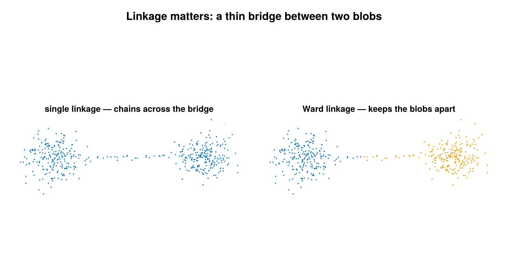

# Hierarchical

Agglomerative hierarchical clustering of SMLM localizations, exposed as a
`cluster` labeling backend through `HierarchicalConfig`. It is backed by
`Clustering.hclust` + `cutree`: a per-group pairwise distance matrix is built,
merged bottom-up into a dendrogram, then cut into flat clusters either at a
height (`cut_threshold`) or to a fixed number of clusters (`n_clusters`).



*Cut to two clusters on two blobs joined by a thin bridge. Single linkage **chains**
across the bridge, so both blobs land in the same cluster (the 2-cluster cut only peels
off a stray point); Ward keeps the blobs apart (right).*

## Concept

Agglomerative clustering starts with every localization in its own singleton
cluster and repeatedly merges the two **closest** clusters until a single tree
(the *dendrogram*) remains. "Closest" is defined by a **linkage criterion** that
extends the point-to-point distance to a cluster-to-cluster distance. The
backend supports four linkages:

- `:single` — nearest-neighbor distance between the two clusters (chaining-prone,
  finds elongated structure).
- `:complete` — farthest-neighbor distance (compact, roughly spherical clusters).
- `:average` — mean pairwise distance between the clusters (UPGMA, a middle
  ground).
- `:ward` — merge the pair whose union increases total within-cluster variance
  the least; tends to produce balanced, compact clusters.

The dendrogram records, at every merge, the height (linkage distance) at which it
happened. A flat clustering is obtained by **cutting** the tree: either
horizontally at a chosen height — every subtree joined below that height becomes
a cluster — or by requesting exactly a target **number of clusters**. Cutting by
height answers "group everything closer than `h`"; cutting by count answers "give
me `K` groups", and is the natural choice when the height has no intuitive unit.

## How it works

For each group of localizations (one group per dataset when `per_dataset = true`,
otherwise the whole SMLD), the backend:

1. Extracts a $d \times n$ coordinate matrix in **microns** ($d = 2$, or
   $d = 3$ when `use_3d = true`).
2. Builds the symmetric $n \times n$ Euclidean pairwise-distance matrix

   ```math
   D_{ij} = \lVert x_i - x_j \rVert_2 ,
   ```

   so $D$ is in microns. This $O(n^2)$ matrix is the dominant cost.
3. Runs `Clustering.hclust(D, linkage = ...)` to build the dendrogram, then
   `Clustering.cutree` to flatten it.
4. Relabels any cluster with fewer than `min_points` members as noise
   (`id = 0`); surviving clusters are renumbered compactly $1..K$ within the
   group.

### Linkage math

At each step the two clusters $A$ and $B$ minimizing the cluster distance
$d(A, B)$ are merged. The four linkages differ only in $d(A, B)$:

```math
\begin{aligned}
\text{single:}   &\quad d(A,B) = \min_{a \in A,\, b \in B} D_{ab} \\
\text{complete:} &\quad d(A,B) = \max_{a \in A,\, b \in B} D_{ab} \\
\text{average:}  &\quad d(A,B) = \frac{1}{|A|\,|B|} \sum_{a \in A} \sum_{b \in B} D_{ab} \\
\text{ward:}     &\quad d(A,B) = \sqrt{\frac{2\,|A|\,|B|}{|A| + |B|}}\; \lVert \mu_A - \mu_B \rVert_2 ,
\end{aligned}
```

where $\mu_A, \mu_B$ are the cluster centroids. For single/complete/average the
merge height is a genuine *distance* (microns, inherited from $D$). For Ward the
height tracks the **increase in total within-cluster variance** caused by the
merge — a cost with units of roughly micron² rather than a distance.

### The cut and its unit convention

Exactly one of `cut_threshold` or `n_clusters` controls the cut:

- **`cut_threshold` (cut by height).** For the distance-based linkages
  (`:single`, `:complete`, `:average`) the value is given in **nanometers** and
  converted to microns internally before cutting, to match the micron-valued
  dendrogram height:

  ```math
  h = \frac{\texttt{cut\_threshold}}{1000} \quad (\text{nm} \rightarrow \mu\text{m}).
  ```

  For `:ward` the dendrogram height returned by `Clustering.hclust` is the **square
  root of the within-cluster variance increase** (the Ward cost is computed on
  squared distances, then the heights are square-rooted), so it carries a
  distance-like (≈ µm) scale rather than a raw variance (µm²) one. `cut_threshold`
  is **passed through unchanged** — there is still no simple "nm" interpretation, so
  because the height is hard to set by intuition, `n_clusters` is the clean choice
  for Ward.

- **`n_clusters` (cut by count).** Cuts the dendrogram to produce exactly that
  many clusters (capped at the group size), counted *before* the `min_points`
  filter is applied. Units-agnostic, so it works the same for any linkage.

## Configuration

`HierarchicalConfig` fields (algorithm-specific fields followed by the shared
backend fields):

| field | default | unit | meaning |
|---|---|---|---|
| `cut_threshold` | `nothing` | nm (distance linkages) / Ward height ≈ µm (Ward) | dendrogram cut height; converted nm→µm for `:single`/`:complete`/`:average`, passed through unchanged for `:ward` |
| `n_clusters` | `nothing` | — | cut the dendrogram to exactly this many clusters (before `min_points` filtering) |
| `linkage` | `:ward` | — | linkage criterion: `:single`, `:complete`, `:average`, or `:ward` |
| `min_points` | `5` | count | clusters with fewer than this many members after cutting are relabeled noise (`id = 0`) |
| `use_3d` | `false` | — | include the z-coordinate in the distance calculation (shared field) |
| `per_dataset` | `true` | — | cluster within each dataset independently, so `(dataset, id)` is unique (shared field) |
| `remove_unclustered` | `false` | — | drop noise emitters (`id == 0`) from the returned SMLD (shared field) |

**Exactly one of `cut_threshold` / `n_clusters` must be supplied.** Supplying
both, or neither, raises an `ArgumentError`. Additional validation: `cut_threshold`
must be `> 0`, `n_clusters` must be `≥ 1`, `min_points` must be `≥ 1`, and
`linkage` must be one of the four supported symbols.

```julia
# Distance-based linkage: cut_threshold is in nm (converted to µm internally).
cfg = HierarchicalConfig(cut_threshold = 200.0, linkage = :single)
(smld_out, info) = cluster(smld, cfg)
```

```julia
# Ward linkage: specify the number of clusters directly (units-agnostic).
cfg_ward = HierarchicalConfig(n_clusters = 3, linkage = :ward)
(smld_out, info) = cluster(smld, cfg_ward)
```

## Output & interpretation

`cluster(smld, cfg::HierarchicalConfig)` returns a `(smld_out, info)` tuple. The
input `smld` is **not modified** — emitters are deep-copied and cluster labels
are written onto the copy's `emitter.id`: `0` marks noise, `1..K` mark distinct
clusters (per-dataset when `per_dataset = true`). When `remove_unclustered = true`,
noise emitters are dropped from `smld_out`.

The companion `info` is a `ClusterInfo` with `algorithm = :hierarchical` and the
usual summary fields: `n_locs_in`, `n_clustered`, `n_noise`, `n_clusters`,
`cluster_sizes` (size of each cluster, indexed by id), and `elapsed_s`.

```julia
(smld_out, info) = cluster(smld, HierarchicalConfig(n_clusters = 3, linkage = :ward))
info.algorithm                                   # :hierarchical
println("$(info.n_clustered)/$(info.n_locs_in) clustered into $(info.n_clusters) clusters")
```

## Notes & caveats

- **Memory / scalability.** The $O(n^2)$ pairwise distance matrix is built per
  group, so memory grows quadratically with group size. This backend is intended
  for **small groups**; for datasets with ≫10,000 localizations per group, prefer
  DBSCAN.
- **2D and 3D.** Both are supported; set `use_3d = true` to include the
  z-coordinate (requires 3D emitters with a `:z` property).
- **Ward unit caveat.** Under `:ward` the cut height is `Clustering.jl`'s Ward height
  — the square root of the within-cluster variance increase (≈ µm scale), not a raw
  inter-point distance, and not nm-converted — so `cut_threshold` values are not
  comparable across linkages. When using Ward, prefer `n_clusters`.

## References

- Clustering.jl `hclust` / `cutree` documentation:
  <https://juliastats.org/Clustering.jl/stable/hclust.html>
- Ward, J. H. (1963). "Hierarchical Grouping to Optimize an Objective Function."
  *Journal of the American Statistical Association*, 58(301), 236–244.
