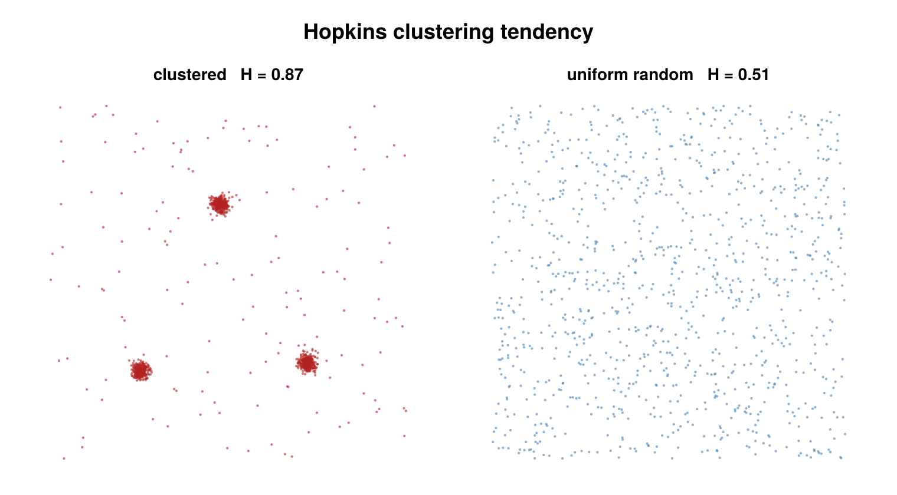

# Hopkins statistic

A `cluster_statistics` backend, selected by `HopkinsConfig`, that measures the
**clustering tendency** of an unlabeled point set — whether the data is clustered
at all, before any cluster is actually formed. The statistic is sample-based and
uses a KDTree nearest-neighbor backend (`NearestNeighbors.jl`).



*Hopkins H on clustered data (H → 1) versus spatially-uniform data (H ≈ 0.5).*

## Concept

Clustering *tendency* is a separate question from clustering itself. Algorithms
like DBSCAN will partition any input into clusters and noise; the Hopkins
statistic instead asks the prior question — is there structure worth clustering,
or is the point set indistinguishable from spatial randomness?

It answers this by comparing two sets of nearest-neighbor distances: the NN
distances of **real** data points to other real points, against the NN distances
of **uniformly-sampled synthetic** points (drawn from the same bounding box) to
the real data. When the data is clustered, real points sit close to their
neighbors (small real-to-real distances) while a uniform point typically lands in
empty space (large synthetic-to-data distances), driving the statistic toward 1.
When the data is itself uniform, the two distance sets look alike and the
statistic sits near 0.5.

## How it works

For each repeat, with $m$ = `n_samples` and the data living in $d$ dimensions
($d = 2$, or $d = 3$ when `use_3d = true`):

1. **Synthetic reference points.** Draw $m$ points uniformly in the per-group
   axis-aligned bounding box. For each reference point, let $u_i$ be its
   nearest-neighbor distance to the real data (a `k = 1` KDTree query).
2. **Sampled real points.** Draw $m$ real points without replacement from the
   data set. For each sampled point, let $w_i$ be its nearest-neighbor distance
   to the **other** real points, excluding itself (a `k = 2` KDTree query, taking
   the second-nearest, since the nearest neighbor of a data point in its own tree
   is itself at distance 0).

The Hopkins statistic for that repeat raises each distance to the **power $d$**
(the spatial dimension) and forms:

```math
H = \frac{\sum_{i=1}^{m} u_i^{\,d}}
         {\sum_{i=1}^{m} u_i^{\,d} + \sum_{i=1}^{m} w_i^{\,d}}
```

When the denominator $\sum u_i^{\,d} + \sum w_i^{\,d}$ is exactly 0, that repeat's
$H$ is `NaN`. The reported value is the mean of $H$ over the `random_repeats`
independent repeats.

## Configuration

`HopkinsConfig <: AbstractStatisticsConfig`:

| field | default | unit | meaning |
|---|---|---|---|
| `n_samples` | `20` | — | number of reference / sampled points $m$ per repeat; if it exceeds a group's point count, that group returns `NaN` (not an error) |
| `random_repeats` | `1` | — | number of independent repeats to average; higher reduces variance at linear cost |
| `seed` | `nothing` | — | when set (`Int`), seeds an internal `Xoshiro` for reproducibility; when `nothing`, uses the global RNG |
| `use_3d` | `false` | — | include the z-coordinate and use $d = 3$ in the formula |
| `per_dataset` | `true` | — | when `true`, compute Hopkins per dataset and report the across-dataset mean as `statistic`; when `false`, pool all emitters into a single $H$ |
| `region` | `nothing` | — | observation window for the uniform **reference** points (2D). `nothing` = data bounding box; a polygon `Vector{NTuple{2,Float64}}` = rejection-sample references inside it; `:metadata` = read `smld.metadata["edge_outer_polygon"]` (written by `classify_emitters`); `Dict(dataset_id => polygon)` = per dataset. Incompatible with `use_3d = true` |

Validated at dispatch entry: `n_samples ≥ 1` and `random_repeats ≥ 1`, else an
`ArgumentError` is raised.

```julia
using SMLMClustering

cfg = HopkinsConfig(
    n_samples      = 50,    # reference / sampled point count per repeat
    random_repeats = 10,    # average over independent repeats
    seed           = 1,     # RNG seed for reproducibility
    use_3d         = false,
    per_dataset    = true,  # per-dataset H in extras + across-dataset mean as statistic
)

(_, info) = cluster_statistics(smld, cfg)

println("Hopkins H = ", round(info.statistic, digits = 3))
per_ds = info.extras[:hopkins_per_dataset]   # Vector{Float64}, one H per dataset
println("per-dataset H = ", per_ds)
```

## Output & interpretation

`cluster_statistics` returns `(smld, info::ClusterStatisticsInfo)`. The SMLD is
passed through unchanged — the Hopkins backend reads coordinates only and writes
nothing back.

- `info.statistic` — the Hopkins $H$. When `per_dataset = true` this is the mean
  over datasets with a non-`NaN` result (`NaN` only if every dataset is `NaN`);
  when `per_dataset = false` it is the single pooled $H$.
- `info.statistic_name` and `info.algorithm` are both `:hopkins`.
- `info.extras[:hopkins_per_dataset]` — a `Vector{Float64}` holding the per-dataset
  $H$ (one entry per group, in dataset order). This key is present only when
  `per_dataset = true`; with `per_dataset = false` the `extras` dictionary is
  empty.

Reading the value:

| $H$ | meaning |
|---|---|
| $\approx 0.5$ | data is statistically indistinguishable from uniform spatial randomness (Poisson) |
| $\to 1.0$ | strong clustering tendency |
| $\to 0.0$ | regular / lattice-like (anti-clustering, even spacing) |

**Edge cases** return `NaN` for the affected group rather than erroring:

- an **empty group** (no emitters in that dataset),
- **`n_samples > n_points`** for the group (or fewer than 2 points),
- a **zero-extent bounding box** — all points coincident along some axis, so
  uniform sampling is degenerate.

With `per_dataset = true`, a `NaN` group is recorded in
`extras[:hopkins_per_dataset]` and excluded from the `statistic` mean.

## Notes & caveats

- **Observation window (the `region` field).** Hopkins is **window-sensitive** — its
  null is "uniform *within a stated window*", and the reference points define that
  window. The default window is the data bounding box, so data that is uniform but
  confined to a **non-convex boundary** (e.g. a cell) reads as falsely *clustered*:
  bbox references fall in the empty corners, far from any data, inflating $H$. Pass a
  `region` polygon (or `:metadata` to use EdgeClassify's `edge_outer_polygon`) to
  sample references inside the actual domain and recover the correct null.
- **Sampling variance.** $H$ is a Monte-Carlo estimate: each call draws random
  reference and sample points, so successive runs differ. Raise `random_repeats`
  to average the variance down (linear cost), and set `seed` to make a run
  bit-for-bit reproducible.
- **`n_samples` relative to group size.** `n_samples` must not exceed the number
  of points in a group; oversized requests yield `NaN` for that group. Smaller
  $m$ gives a noisier estimate, so pair small samples with more repeats.
- **2D / 3D.** The default is 2D ($d = 2$); set `use_3d = true` to include the
  z-coordinate and use $d = 3$ in both the KDTree queries and the distance power.

## References

- Hopkins, B. and Skellam, J. G. (1954). "A new method for determining the type
  of distribution of plant individuals." *Annals of Botany*, 18(2), 213–227.
