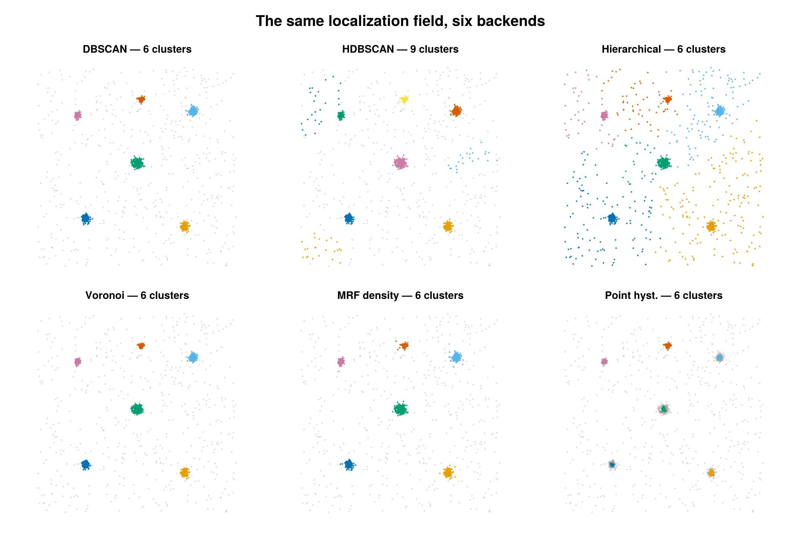

```@meta
CurrentModule = SMLMClustering
```

# Methods overview

SMLMClustering bundles several spatial-analysis backends behind three verbs. This
page is the map: what each backend *is*, the family of algorithm it belongs to, and
how to choose between them. Each method then has its own page with the concept, the
math, the configuration, and a worked example.

## Catalog

### Labeling — `cluster`

Assign a cluster id to every emitter (`0` = noise, `1..K` = clusters).

| Method | Family | 2D/3D | Scales to large *n*? |
|--------|--------|-------|----------------------|
| [DBSCAN](@ref) | density / `ε`-neighborhood | 2D + 3D | yes (KD-tree) |
| [Precision DBSCAN](@ref) | density, σ-weighted neighborhood | 2D + 3D | yes (KD-tree) |
| [HDBSCAN](@ref) | hierarchical density | 2D + 3D | moderate |
| [Hierarchical](@ref) | agglomerative linkage | 2D + 3D | no (O(*n*²) per group) |
| [Voronoi (SR-Tesseler)](@ref "Voronoi (SR-Tesseler)") | tessellation density | 2D only | yes |
| [MRF density-regime](@ref "MRF density-regime") | GMM + Potts MRF on a neighbor graph | 2D only | yes |
| [Point hysteresis](@ref "Point hysteresis") | seed-and-grow on a kNN graph | 2D + 3D | yes |

### Spatial statistics — `cluster_statistics`

Read-only summaries; the SMLD is returned untouched.

| Method | Reports |
|--------|---------|
| [Hopkins statistic](@ref) | clustering tendency `H` (is there structure at all?) |
| [Voronoi density](@ref) | per-emitter Voronoi cell area + local density `ρ = 1/A` |
| [Local contrast](@ref) | per-emitter local-vs-neighborhood density contrast feature |

### Edge classification — `classify_emitters`

| Method | Reports |
|--------|---------|
| [Edge / Membrane Classification](@ref) | per-emitter `:outside` / `:membrane` / `:interior` |

## Labeling vs. classification

All three verbs attach per-emitter information, but they are different kinds of
operation and — by design — store their answers in different places:

- **`cluster` assigns an instance label.** It writes an integer onto each
  `emitter.id` (`0` = noise, `1..K` = clusters); `K` is discovered from the data and
  the ids are only meaningful within a run. This is *instance grouping*: "which
  cluster does this point belong to?"
- **`classify_emitters` assigns a semantic class.** It leaves `emitter.id` untouched
  and stores the per-emitter class — a *fixed* vocabulary (`:outside` / `:membrane` /
  `:interior`) — in `info.class` (read via `in_cell` / `interior_mask`), threading only
  the boundary geometry (`edge_cells` / `edge_outer_polygon`) into `smld.metadata`. This
  is *semantic labeling*: "what kind of region is this point in?" — stable and
  self-describing across runs.
- **`cluster_statistics` assigns nothing.** It is read-only and returns summary
  scalars/vectors, leaving the SMLD unchanged.

Because labeling and classification write to *different fields*, **they compose** —
classify into a region, then cluster within it (or cluster, then ask which clusters
fall in the membrane). If both wrote to `emitter.id`, the second step would overwrite
the first.

```julia
# Classify, keep the cell interior, then cluster within it.
_, edge = classify_emitters(smld, KdeValleyConfig())
keep    = [e for (e, c) in zip(smld.emitters, edge.class) if c === :interior]
inner   = SMLMData.BasicSMLD(keep, smld.camera, smld.n_frames, smld.n_datasets, smld.metadata)
inner_out, info = cluster(inner, DBSCANConfig(eps_nm = 50.0, min_points = 5))
```

## Concepts & vocabulary

- **Emitter / localization.** A single blinking event with a position (and
  uncertainty). The input is an `SMLMData.BasicSMLD`; positions are in **µm**, but
  most clustering parameters that have a physical length are specified in **nm** for
  convenience (each backend page states its units explicitly).
- **Cluster id.** Labeling backends write an integer onto each `emitter.id`: `0`
  marks **noise / unclustered** points, and `1..K` mark distinct clusters.
- **`min_points`.** For most labeling backends, the minimum number of emitters a
  cluster must contain to count as real rather than noise. **HDBSCAN is the
  exception:** there `min_points` is the core-distance neighbor count *k* (the
  density-smoothing scale), while a separate `min_cluster_size` sets the size
  threshold.
- **`per_dataset`.** SMLD data can hold several datasets (e.g. cells / ROIs). When
  `per_dataset = true` (the default) each dataset is clustered independently and the
  pair `(dataset, id)` uniquely identifies a cluster; ids are local to a dataset.
- **Density-based vs. tessellation vs. hierarchical.** Density methods
  ([DBSCAN](@ref), [Point hysteresis](@ref "Point hysteresis")) grow clusters from
  regions where points are closer than a length scale. Tessellation methods
  ([Voronoi (SR-Tesseler)](@ref "Voronoi (SR-Tesseler)"), [Voronoi density](@ref))
  turn each point's Voronoi-cell area into a local density and threshold on it.
  Hierarchical methods ([Hierarchical](@ref), [HDBSCAN](@ref)) build a tree of
  merges and cut it. The [MRF density-regime](@ref "MRF density-regime") backend
  adds a smoothness prior over a neighbor graph so density labels are spatially
  coherent.
- **Clustering tendency.** Before clustering, the [Hopkins statistic](@ref) asks
  whether the data is clustered *at all*, versus consistent with spatial randomness.

## Choosing a backend



*One synthetic field, six backends. Unclustered noise (`id = 0`) is gray. Density
methods isolate the clusters and reject noise; HDBSCAN over-splits here; hierarchical
cut to a fixed count has no noise class, so it absorbs the background into the nearest
cluster.*

- **Start with [DBSCAN](@ref)** — it scales, works in 2D and 3D, has no O(*n*²)
  memory cost, and has only two intuitive knobs (`eps_nm`, `min_points`).
- **Single global `ε` fails** when tight aggregates coexist with extended
  structure → use the [MRF density-regime](@ref "MRF density-regime") backend, which
  infers per-emitter density regimes.
- **Want a parameter-light, calibration-free 2D density rule** following
  SR-Tesseler → [Voronoi (SR-Tesseler)](@ref "Voronoi (SR-Tesseler)").
- **Small groups, want a specific cluster count or a dendrogram** →
  [Hierarchical](@ref).
- **Just need a density feature for your own downstream thresholding** →
  [Voronoi density](@ref) or [Local contrast](@ref) via `cluster_statistics`.
- **Want to know if clustering is even present** → [Hopkins statistic](@ref).

See the [User Guide](@ref "User Guide") for the shared calling conventions and the
`ClusterInfo` / `ClusterStatisticsInfo` result fields.
