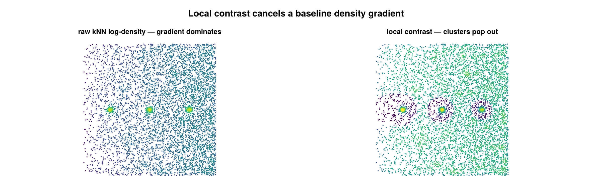

# Local contrast

A `cluster_statistics` feature, configured by `LocalContrastFeature`, that computes a
per-emitter **local-density contrast**: each point's fine-scale kNN log-density minus
the median fine-scale log-density over a larger surrounding neighborhood. Positive
values mark points that are denser than their local background; the result is a
per-emitter feature vector the caller thresholds directly.



*A baseline density gradient (sparse left → dense right) hides three clusters in the raw
kNN density (left). Subtracting a local baseline cancels the gradient, so the clusters
stand out (right).*

## Concept

A raw density estimate cannot tell a point in a compact structure apart from a point
in a uniformly dense region — both report a high absolute density. Local contrast
captures the *elevation* of a point's density above the density of its own
surroundings: the same number of neighbors packed into a tight core gives a large
contrast, while neighbors spread evenly over the baseline give a contrast near zero.

This matters because the absolute-density classifier (Otsu / GMM on log density)
calls a point "structure" whenever its density exceeds a single global cutoff. When
the baseline density varies across the field of view — cell-edge thinning,
illumination falloff, a biological gradient — that one cutoff is wrong on at least one
side of the cell. Subtracting a coarse *local* baseline cancels the gradient, so the
feature fires only where a point is denser than its immediate neighborhood rather than
denser than the cell-wide average. The per-emitter vector is meant to be thresholded
into a foreground mask, e.g. as the seed/support gates of a point-hysteresis
seed-and-grow on clouds with non-stationary baseline density.

## How it works

Coordinates are taken in microns (µm) from the emitters (2D `(x, y)`, or `(x, y, z)`
when `use_3d=true`). A `KDTree` is built over the coordinate set (per dataset or
pooled, see [Configuration](#Configuration)). Write $k_d$ for `density_k` and $k_b$
for `background_k`.

**1. Fine kNN log-density.** For each emitter $i$, let $r_{k}$ be the Euclidean
distance to its $k_d$-th nearest neighbor (excluding the point itself). The kNN
density estimate normalizes the neighbor count by the disk area $\pi r_k^2$, and the
feature stores its natural log:

```math
f_i = \log\!\left(\frac{k_d}{\pi\, r_{k}^{2}}\right)
```

The log keeps the downstream median and threshold comparisons on a comparable scale
across a cell. If $r_k = 0$ (coincident coordinates), $f_i$ is set to `NaN`.

**2. Local baseline.** For each emitter $i$, take the **median** of $f_j$ over its
$k_b$ nearest neighbors (excluding self, skipping any non-finite $f_j$). The median
(rather than the mean) tolerates a small number of locally elevated neighbors without
dragging the baseline up.

**3. Contrast.** The per-emitter feature is the difference

```math
c_i = f_i - \operatorname{median}_{\,j \in k_b\text{-NN}(i)} f_j
```

Because it is a difference of logs, $c_i$ is the log-ratio of the point's fine density
to its local baseline density: $c_i > 0$ means point $i$ is denser than its
surroundings, $c_i \approx 0$ means it matches the baseline, and $c_i < 0$ means it is
sparser. The value is reported in nats (natural-log scale).

## Configuration

`LocalContrastFeature` is a `Base.@kwdef struct <: AbstractStatisticsConfig`:

| field | default | unit | meaning |
|---|---|---|---|
| `density_k` | `200` | count | fine-scale neighbor count $k_d$ for the per-point log-density; sets the spatial scale of the *signal* |
| `background_k` | `2000` | count | coarse-scale neighbor count $k_b$ for the local baseline; sets the spatial scale of the *baseline*. Must be `> density_k` |
| `use_3d` | `false` | — | if `true`, build the KDTree over `(x, y, z)` instead of `(x, y)` |
| `per_dataset` | `false` | — | if `true`, compute each dataset independently (its own KDTree); per-emitter outputs are stitched back into original emitter order either way |

Validation happens at the `cluster_statistics` call: `background_k > density_k` and
`density_k ≥ 1` are required, otherwise an `ArgumentError` is raised (the baseline must
be coarser than the signal).

```julia
using SMLMClustering
using Statistics   # for `quantile` in the thresholding example below

# smld :: SMLMData.BasicSMLD
(_, info) = cluster_statistics(smld, LocalContrastFeature(density_k=200, background_k=2000))

info.statistic        # median of the finite per-emitter contrasts (scalar summary)
info.statistic_name   # :median_local_contrast
info.algorithm        # :local_contrast

contrast = info.extras[:contrast_per_emitter]      # Vector{Float64}, per emitter
fine     = info.extras[:log_density_per_emitter]   # Vector{Float64}, the fine f_i

# Threshold the per-emitter feature directly, e.g. seed/support gates for
# hysteresis seed-and-grow on a non-stationary baseline:
fine_floor = quantile(filter(isfinite, fine), 0.35)
seed    = isfinite.(contrast) .& (contrast .> 0.25)  .& (fine .> fine_floor)
support = isfinite.(contrast) .& (contrast .> -0.05) .& (fine .> fine_floor)
(smld_out, _) = cluster(smld, PointHysteresisConfig(graph_k=12, min_points=150);
                        seed=seed, support=support)
```

## Output & interpretation

`cluster_statistics` returns `(smld, info)` where `smld` is the unmodified input (the
statistics interface writes nothing onto the SMLD) and `info` is a
`ClusterStatisticsInfo`:

- `info.statistic` — the **median of the finite contrast values** pooled across all
  groups; a single-scalar summary of the run. It is `NaN` when no group has enough
  points to compute the feature.
- `info.statistic_name` — `:median_local_contrast`.
- `info.algorithm` — `:local_contrast`.
- `info.extras[:contrast_per_emitter]` — `Vector{Float64}` of length `n_locs_in`, the
  per-emitter contrast $c_i$, in **original emitter order**. This is the primary
  output the caller thresholds.
- `info.extras[:log_density_per_emitter]` — `Vector{Float64}` of length `n_locs_in`,
  the fine kNN log-density $f_i$, also in original emitter order. Useful as a
  complementary absolute-density gate (e.g. require $f_i$ above a quantile floor in
  addition to a positive contrast).

Interpretation: a **high** positive contrast is a point sitting in a local density
peak (a candidate structure point); a contrast **near zero** is a point whose density
matches its surroundings (uniform background, regardless of how dense that background
is); a **negative** contrast is a point sparser than its neighborhood. Because the
baseline is local, the same contrast threshold applies on both the dense and the thin
side of a density gradient.

## Notes & caveats

- **2D / 3D.** Both are supported via `use_3d`. The KDTree and neighbor distances are
  taken in the chosen dimensionality, but the density normalization is always the 2D
  disk area $\pi r_k^2$ in $f_i$ — even when `use_3d=true`. The contrast difference
  still behaves sensibly, but the absolute `log_density_per_emitter` scale is a 2D-area
  form, not a true 3D (volume) density.
- **Too-small groups.** A group with $n \le k_d$ emitters cannot be evaluated; those
  emitters receive `NaN` for both contrast and log-density (avoids a degenerate kNN
  query against a too-small set).
- **`background_k ≥ n` in a group.** $k_b$ is clamped to $n-1$ for that group, so the
  feature degrades gracefully to "log-density minus the group median," which is still
  well-defined.
- **Coincident coordinates.** A point whose $k_d$-th-neighbor distance is zero
  ($r_k = 0$) receives `NaN` log-density and `NaN` contrast. A point with no finite
  baseline neighbors also receives `NaN` contrast.
- **`per_dataset`.** When `true`, each dataset is built and evaluated on its own
  KDTree (no cross-dataset neighbors); when `false`, all emitters are pooled into one
  tree. Either way the per-emitter outputs are returned in original emitter order, and
  `info.statistic` is the median over the finite contrasts of the whole input.
- **NaN handling.** Both extras vectors are initialized to `NaN` and only filled where
  the feature is computable, so callers should mask with `isfinite` (as the example
  does) before thresholding or aggregating.
