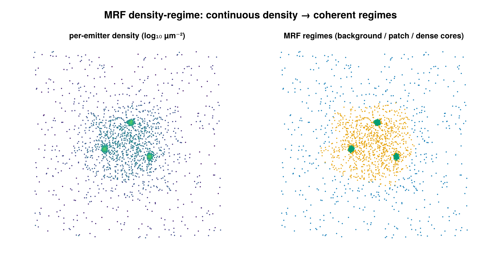

# MRF density-regime

Adaptive-density clustering for 2D SMLM data that mixes density regimes — e.g.
tight ~25 nm aggregates coexisting with µm-scale extended structure — where a
single global ε would either over-merge the loose structure or shatter the
tight knots. It is a `cluster` labeling backend selected by dispatch on
`MRFDensityClusterConfig`: per-emitter density regimes are inferred, spatially
smoothed, and the foreground is carved into clusters by connected components.



*Left: per-emitter density on a field with sparse background, a medium-density patch,
and dense cores. Right: the MRF assigns each emitter to one of three spatially-coherent
density regimes.*

## Concept

A single distance/density threshold cannot serve a dataset with several
density populations. Instead of one global parameter, this backend infers a
per-emitter **density regime** from the local point density, then enforces
spatial coherence on those regime labels before extracting clusters:

1. **Per-emitter density regimes.** Each emitter's local density (Voronoi
   `1/area` or kNN `k/(πr_k²)`) is mapped to `log ρ`, and a 1D
   `n_regimes`-component Gaussian mixture is fit over `log ρ`. Components are
   sorted ascending by mean, so regime 1 is the lowest-density (background)
   population and `n_regimes` is the densest.
2. **Spatial smoothing via a Potts MRF.** Raw per-emitter regime labels are
   noisy. A multi-class Potts Markov random field over the Delaunay (or kNN)
   neighbor graph penalizes neighboring emitters carrying different labels.
   This pulls borderline interior points up to foreground when their neighbors
   are foreground (fixes "missing middles") and pulls isolated tight knots in a
   low-density sea back down to background (kills spurious small clusters).
3. **Clusters = connected components on the foreground.** The foreground is
   defined as regime `≥ 2`. Connected components are computed over the same
   neighbor graph restricted to foreground nodes; components smaller than
   `min_points` are demoted to noise.

The lowest regime is treated as background/noise; only regime `≥ 2` is fed to
the connected-components step.

## How it works

**Step 1 — local density.** Per emitter `i`, density is estimated in one of two
ways. The Voronoi estimator uses the inverse cell area,

```math
\rho_i = \frac{1}{A_i},
```

which is simple but noisy (`σ_log ≈ 1`, since it averages over a single cell)
and biased downward for thin elongated structures whose cells spill across the
patch boundary. The kNN estimator (Loftsgaarden & Quesenberry 1965) integrates
over the `density_k` nearest neighbors,

```math
\rho_i = \frac{k}{\pi\, r_{k,i}^2},
```

where `r_{k,i}` is the Euclidean distance from `i` to its `k`-th nearest
neighbor. This reduces noise to `σ_log ≈ 1/√k` and recovers patch-interior
detection at the cost of some boundary blur. Each density is converted to
`log ρ_i`; emitters with non-finite or non-positive density are dropped from
the fit.

**Step 2 — regime assignment.** A 1D `n_regimes`-component Gaussian mixture is
fit to the valid `log ρ` values by EM (deterministic quantile initialization,
no randomness), producing weights `w_k`, means `μ_k`, and variances `σ_k²`
sorted ascending by mean. The data term is the per-emitter, per-regime unary
cost

```math
U_{i,k} = -\log\!\bigl(w_k\, \mathcal{N}(\log\rho_i \mid \mu_k, \sigma_k^2)\bigr).
```

When `regime_thresholds` is supplied the GMM is bypassed and emitters are
hard-binned (`U_{i,k}=0` for the matching bin, `10^6` for the rest). When
`regime_gaussians` is supplied the GMM is bypassed but the same soft Gaussian
unaries above are built from the calibrated `(means, vars, weights)`.

**Step 3 — Potts MRF refinement.** Labels `L` minimize the multi-class Potts
energy over the neighbor graph,

```math
E(L) = \sum_i U_{i,L_i} \;+\; \lambda \sum_{(i,j)\in\mathcal{G}} \mathbb{1}[L_i \neq L_j],
```

i.e. the pairwise term charges `λ` for every graph edge whose endpoints carry
different labels. The neighbor graph `\mathcal{G}` is the Delaunay
triangulation (default, reusing the step-1 tessellation) or a symmetrized kNN
graph (`graph_kind=:knn`, using `graph_k`). Minimization is by Iterated
Conditional Modes (ICM): labels initialize to the per-emitter unary argmin,
then each emitter is repeatedly reassigned to the label minimizing
`U_{i,k} + λ · (#neighbors with label ≠ k)`, sweeping until no label changes or
`icm_iters` is reached. When `smoothness_lambda` is `nothing`, `λ` is auto-set
per group from the spread of the unary range:

```math
\lambda = \max\!\bigl(10^{-6},\; \mathrm{MAD}_i(U_{i,\max} - U_{i,\min})\bigr),
```

where MAD is the median absolute deviation over valid emitters — a
data-scale-free heuristic that needs no per-dataset tuning.

**Step 4 — connected components.** Foreground emitters (regime `≥ 2`) are
grouped by breadth-first connected components over the neighbor graph
restricted to foreground nodes, so foreground points linked through a short
chain of other foreground points merge into one cluster. Components below
`min_points` are demoted to noise and the surviving clusters are
compact-relabeled `1..K`.

When `per_dataset=true` (default) the entire pipeline runs independently per
dataset, so each cell gets its own GMM fit and auto-adapts to whatever density
scale it lives at.

## Configuration

`MRFDensityClusterConfig` fields:

| field | default | unit | meaning |
|---|---|---|---|
| `n_regimes` | `2` | — | number of density regimes (`≥ 2`); regime 1 is background/noise, `≥ 2` is foreground |
| `regime_thresholds` | `nothing` | log-density | optional explicit hard-bin thresholds, length `n_regimes - 1`, sorted ascending; bypasses GMM (borderline points cannot be rescued by neighbors) |
| `regime_gaussians` | `nothing` | log-density | optional calibrated soft emission model `(means, vars, weights)`; bypasses GMM but keeps soft unaries so the Potts prior can still flip borderline points |
| `density_estimator` | `:voronoi` | — | `:voronoi` = `1/cell-area`; `:knn` = `k/(πr_k²)` |
| `density_k` | `20` | — | `k` for the kNN density estimator (`:knn` only); larger `k` → lower variance, more boundary blur; recommended 10–50 |
| `smoothness_lambda` | `nothing` | unary-cost units | Potts smoothness weight `λ`; `nothing` → auto-set per group to `max(1e-6, MAD(U_max - U_min))`; must be `> 0` if set |
| `graph_kind` | `:delaunay` | — | neighbor graph for MRF and CC; `:delaunay` reuses the Voronoi tessellation when `density_estimator = :voronoi` (otherwise it builds one for the graph), `:knn` builds a symmetrized kNN graph |
| `graph_k` | `8` | — | `k` for the kNN neighbor graph (`graph_kind=:knn` only) |
| `inference` | `:icm` | — | MRF inference algorithm; only `:icm` supported |
| `icm_iters` | `50` | passes | max ICM sweeps; stops early when no label changes |
| `min_points` | `5` | emitters | minimum cluster size after CC; smaller components → noise |
| `use_3d` | `false` | — | must be `false`; `true` raises `ArgumentError` (2D Voronoi only) |
| `per_dataset` | `true` | — | run the full pipeline per dataset so each cell is fit independently |
| `remove_unclustered` | `false` | — | drop noise (`id == 0`) emitters from the output SMLD |

`regime_thresholds` and `regime_gaussians` are mutually exclusive; setting both
raises `ArgumentError`.

```julia
# (a) Default 2-regime auto-tuning: per-dataset GMM finds the
#     foreground/background split, λ is auto-set, CC over Delaunay neighbors.
cfg = MRFDensityClusterConfig()
(smld_out, info) = cluster(smld, cfg)
regimes = smld_out.metadata["mrf_regime_per_emitter"]   # 0..n_regimes per emitter
```

```julia
# (b) 3-regime with manual log-density thresholds (e.g. learned offline).
#     GMM is bypassed; points are hard-binned, then CC on regime >= 2.
cfg = MRFDensityClusterConfig(
    n_regimes         = 3,
    regime_thresholds = [3.5, 5.0],   # length n_regimes - 1, sorted ascending
    min_points        = 10,
)
(smld_out, info) = cluster(smld, cfg)
```

```julia
# (c) Calibrated soft emissions: fit Gaussian unaries on a trusted calibration
#     ROI, then apply to query ROIs. Unlike hard thresholds, borderline
#     interior points can still be rescued by high-density neighbors via Potts.
gaussians = calibrate_regime_gaussians(calibration_smld;
                                       n_regimes         = 2,
                                       density_estimator = :knn,
                                       density_k         = 20)
cfg = MRFDensityClusterConfig(
    density_estimator = :knn,
    density_k         = 20,
    regime_gaussians  = gaussians,   # NamedTuple (means, vars, weights)
)
(smld_out, info) = cluster(query_smld, cfg)
```

`calibrate_regime_gaussians(smld; n_regimes=2, density_estimator=:knn, density_k=20)`
returns the `(means, vars, weights)` NamedTuple in log-density space, ready to
pass as `regime_gaussians`. `calibrate_regime_thresholds(smld; n_regimes=2,
density_estimator=:knn, density_k=20)` is a thin wrapper that returns instead a
`Vector{Float64}` of length `n_regimes - 1` (the analytic Bayes decision
boundaries between consecutive components, midpoint fallback when the
discriminant is negative), ready to pass as `regime_thresholds`.

## Output & interpretation

`cluster` returns the standard `(smld_out, info::ClusterInfo)` tuple. The input
is never mutated — emitters are deep-copied and labels written onto the copy.

- `emitter.id`: `0` for noise (lowest regime, ungroupable, or sub-`min_points`
  component) or `1..K` for cluster membership (per group when
  `per_dataset=true`).
- `info::ClusterInfo`: `n_locs_in`, `n_clustered`, `n_noise`, `n_clusters`,
  `cluster_sizes` (indexed by cluster id), `algorithm == :mrf_density`, and
  `elapsed_s`.

MRF-specific results are stamped onto `smld_out.metadata` (HDBSCAN-style):

| key | type | meaning |
|---|---|---|
| `"mrf_regime_per_emitter"` | `Vector{Int}` | per-emitter regime in `0..n_regimes`, original emitter order; `0` = ungroupable (group `< 3` points or too few valid densities), `1` = lowest density / background, `n_regimes` = highest density. On GMM failure all valid emitters fall back to regime `1`, so the group yields no clusters. |
| `"mrf_lambda_used"` | `Vector{Float64}` | per-group `λ` actually used (auto or explicit), in dataset-group order; `NaN` for skipped groups |
| `"mrf_regime_means"` | `Vector{Vector{Float64}}` | per-group GMM component means in log-density space (sorted ascending); a vector of `NaN`s of length `n_regimes` when `regime_thresholds` was supplied (signals "manual hard binning, no fit"); calibrated means when `regime_gaussians` was supplied |

**Foreground → clusters.** Emitters with regime `≥ 2` form the foreground;
connected components on that foreground (over the neighbor graph) become the
clusters, after the `min_points` filter. So `mrf_regime_per_emitter[i] ≥ 2`
does not by itself guarantee `emitter.id > 0` — the emitter must also land in a
surviving (large-enough) connected component.

## When it works / accuracy

Characterized on a controlled 5×5 µm A431-mimic synthetic (kNN density
estimator, `density_k=20`, 2 regimes, ~13–22 k emitters across 12 patches,
aspect ratios 1–20). Headline accuracy by density ratio (high / low):

| ratio | kNN-MRF | voronoi-GMM (no MRF) |
|-------|---------|----------------------|
| 1.2×  | 35%     | 65%                  |
| 1.5×  | 69%     | 67%                  |
| 2.0×  | 89%     | 72%                  |
| 3.0×  | 95%     | 69%                  |
| 5.0×  | 96%     | 87%                  |

**Use kNN-MRF when the density ratio is `≥ 2×`.** Operational floor: ratio
`≥ 1.65×` clears 75% accuracy; ratio `≥ 1.85×` clears 85%. Below ~1.65× the
two `log ρ` modes nearly overlap, GMM EM picks a degenerate split, and the
Potts smoothness term amplifies the majority label across the graph — a
false-positive saturation collapse (not a graceful recall loss).

**kNN vs Voronoi-GMM.** The Voronoi default preserves backward compatibility
and is the right estimator for blob-shaped clusters. For thin elongated
structures (widths comparable to the local nearest-neighbor distance — fibers
narrower than ~150 nm at high density) Voronoi cells spill across the patch
boundary and produce a patch-interior false-negative band; switch to
`density_estimator=:knn` (with `density_k=20`) to recover interior detection.
Because the MRF lacks the per-emitter independence of plain voronoi-GMM, it
degrades catastrophically rather than gracefully below the density-ratio floor;
at low contrast (ratio `< 2×`) prefer voronoi-GMM or calibrated soft emissions.

**Use calibrated soft emissions** (`calibrate_regime_gaussians` +
`regime_gaussians`) when calibration ROIs are available and the density ratio
is below 2×. This skips per-ROI GMM degeneracy while keeping soft unary costs,
so the MRF can still fill borderline interior points. Hard `regime_thresholds`
also stabilize low-contrast data but forfeit neighbor-rescue (the `10^6`
penalty dwarfs the pairwise term).

**kNN ball-radius bound.** The kNN estimator assumes its ball radius
`r_k ≈ √(k/(πρ))` is smaller than the structure half-width; otherwise the ball
spills into background and the GMM regime split can flip foreground/background.
For thin patches where `density_k=20` is too coarse, drop to `density_k=8–10`.
At 2× contrast the patch-size operating range is: `≥ 1.0 µm` holds 88–89%
(85% gate), `≥ 0.5 µm` clears the 75% gate, and `≤ 0.3 µm` collapses (ball
spillage). Within k ∈ [5, 80] the accuracy curve is concave-up with a shallow
peak at k = 15–20, so the `density_k=20` default is robust.

## Notes & caveats

- **2D only.** `use_3d=true` raises `ArgumentError` (DelaunayTriangulation.jl
  provides no 3D Voronoi). Use `DBSCANConfig` or `HierarchicalConfig` for 3D.
- **Groups with fewer than 3 points** are tagged all-noise (too small to
  tessellate) and recorded as `λ = NaN`, means `= NaN`.
- **Exact-duplicate `(x, y)` coordinates** raise `ArgumentError` only when a Voronoi
  tessellation is actually built — i.e. `density_estimator = :voronoi` or
  `graph_kind = :delaunay`. With `density_estimator = :knn` *and* `graph_kind = :knn`,
  no Voronoi guard runs and duplicates are not rejected.
- **Per-dataset GMM fit.** With `per_dataset=true` each dataset is fit and
  clustered independently; `(dataset, id)` uniquely identifies a cluster.
- **GMM-failure fallback.** If the EM fit collapses (variance collapse,
  all-equal densities, component starvation) the group's valid emitters fall
  back to regime 1 (background) and contribute no clusters.
- **Local MAP inference.** ICM is local MAP, not a global optimizer; pathological
  low-contrast data without a representative calibration ROI can still be
  fragile.

## References

- **Potts model** — the multi-class generalization of the Ising model, used
  here as the pairwise smoothness prior over the neighbor graph.
- **Iterated Conditional Modes (ICM)** — the local MAP inference used to
  minimize the Potts energy.
- **Loftsgaarden, D. O. & Quesenberry, C. P. (1965)** — the `k`-nearest-neighbor
  density estimator `ρ_k = k/(πr_k²)`.
