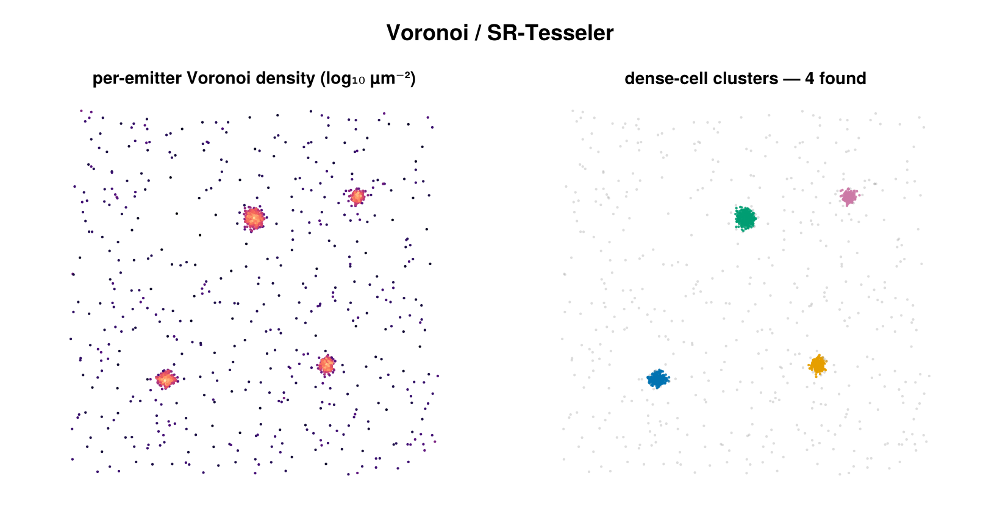

# Voronoi density

A `cluster_statistics` backend (selected by `VoronoiDensityConfig`) that reports
each emitter's Voronoi cell area $A_i$ and its local density $\rho_i = 1/A_i$,
intended as a feature for downstream thresholding (Otsu / GMM on $\log\rho$, a
fixed cutoff, etc.). This is the **read-only sibling** of the Voronoi
(SR-Tesseler) labeling backend: `VoronoiConfig` consumes the same per-emitter
areas to assign clusters, whereas `VoronoiDensityConfig` only **computes the
density feature** and assigns no cluster labels.



*Left: the per-emitter Voronoi density feature this backend computes (bright = dense).
Right: the same cell areas drive the SR-Tesseler labeling backend.*

## Concept

The Voronoi tessellation of a point set partitions the plane into one convex
cell per generator — the region closer to that generator than to any other. The
area of an emitter's cell is small where neighbors crowd in and large where they
are sparse, so the cell area is a parameter-free *inverse* local-density
estimate: $\rho_i = 1/A_i$. Unlike a fixed-radius or $k$-NN density, the cell
adapts its own scale to the local point spacing, which is why Voronoi density is
a robust density feature for the highly heterogeneous point clouds typical of
SMLM. The usual use is **cell-structure masking**: separating dense membrane /
structure regions from sparse background by thresholding $\log\rho$ (e.g. Otsu or
a two-component GMM), as in SR-Tesseler.

## How it works

For each group of emitters (one dataset when `per_dataset = true`, all emitters
pooled otherwise), the backend builds the Voronoi tessellation of the emitter
$(x, y)$ coordinates (in µm) using
[DelaunayTriangulation.jl](https://github.com/JuliaGeometry/DelaunayTriangulation.jl).
The tessellation is **clipped to the convex hull** of the group, so every
generator receives a finite cell area (unbounded hull cells would otherwise have
infinite area). For each emitter $i$ the cell area and density are

```math
A_i = \operatorname{area}\bigl(\text{cell}_i\bigr) \;\; [\mu m^2],
\qquad
\rho_i = \frac{1}{A_i} \;\; [\mu m^{-2}].
```

Each group is tessellated independently; the per-group area and density vectors
are then stitched back into the **original (flat) emitter order**, so the
$i$-th entry always corresponds to `smld.emitters[i]` regardless of how the
emitters were grouped. The summary scalar is the median density over all
emitters that received a valid cell.

## Configuration

`VoronoiDensityConfig <: AbstractStatisticsConfig`. Both fields are keyword
arguments with defaults:

| field | default | unit | meaning |
|---|---|---|---|
| `use_3d` | `false` | — | must be `false`; Voronoi tessellation is 2D only — `true` raises `ArgumentError` |
| `per_dataset` | `true` | — | when `true`, tessellate each dataset independently; when `false`, pool all emitters into one tessellation. Per-emitter outputs stay flat in original emitter order in either case |

```julia
using SMLMClustering

cfg = VoronoiDensityConfig(
    use_3d      = false,    # 2D only — same constraint as VoronoiConfig
    per_dataset = true,     # tessellate each dataset independently
)
(_, info) = cluster_statistics(smld, cfg)

info.statistic        # median density across valid cells (Float64, µm⁻²)
info.statistic_name   # :median_density
info.algorithm        # :voronoi_density

ρ = info.extras[:density_per_emitter]   # Vector{Float64}, length == n_locs_in, µm⁻²
A = info.extras[:area_per_emitter]      # Vector{Float64}, length == n_locs_in, µm²

println("median density = ", round(info.statistic, digits = 2), " µm⁻²")
```

## Output & interpretation

`cluster_statistics` returns `(smld, info)` where `info` is a
`ClusterStatisticsInfo`. The SMLD is the **same, unmodified reference** as the
input — this backend writes nothing onto it.

- `info.statistic` — the **median** of all non-NaN per-emitter densities
  (`statistic_name = :median_density`), a single-number summary of overall
  density in µm⁻². It is `NaN` if no group produced any valid density.
- `info.extras[:density_per_emitter]` — `Vector{Float64}` of length
  `n_locs_in`, in µm⁻².
- `info.extras[:area_per_emitter]` — `Vector{Float64}` of length `n_locs_in`,
  in µm².

Both extras vectors are **flat in original emitter order, not grouped by
dataset**: `ρ[i]` and `A[i]` correspond to `smld.emitters[i]`. Feed
`density_per_emitter` (or `log` of it) into your own thresholding step — Otsu, a
GMM split, or a fixed cutoff — to mask dense structure.

## Notes & caveats

- **2D only.** `use_3d = true` raises `ArgumentError`; DelaunayTriangulation.jl
  does not provide a 3D Voronoi tessellation.
- **Small groups.** Any group with fewer than 3 points cannot be tessellated;
  those emitters receive `NaN` density and `NaN` area while other groups proceed
  normally. An empty SMLD yields empty extras vectors and `statistic = NaN`.
- **Duplicate coordinates.** A group containing exact-duplicate $(x, y)$
  coordinates raises `ArgumentError` before triangulation (duplicate generators
  are treated as a boundary-input issue, not a data-shape edge case — mirroring
  `VoronoiConfig`'s guard). Deduplicate localizations beforehand.
- **Hull clipping.** Because cells are clipped to the convex hull, emitters on or
  near the hull boundary have areas smaller than their infinite-plane Voronoi
  cell would be; their density is correspondingly higher than the interior trend.

## References

- Levet, F. *et al.* **SR-Tesseler: a method to segment and quantify localization-based
  super-resolution microscopy data.** *Nature Methods* **12**, 1065–1071 (2015).
  [doi:10.1038/nmeth.3579](https://doi.org/10.1038/nmeth.3579) — Voronoi-based
  density estimation and segmentation for SMLM.
- [DelaunayTriangulation.jl](https://github.com/JuliaGeometry/DelaunayTriangulation.jl)
  — the pure-Julia Delaunay/Voronoi engine used to build the tessellation.
